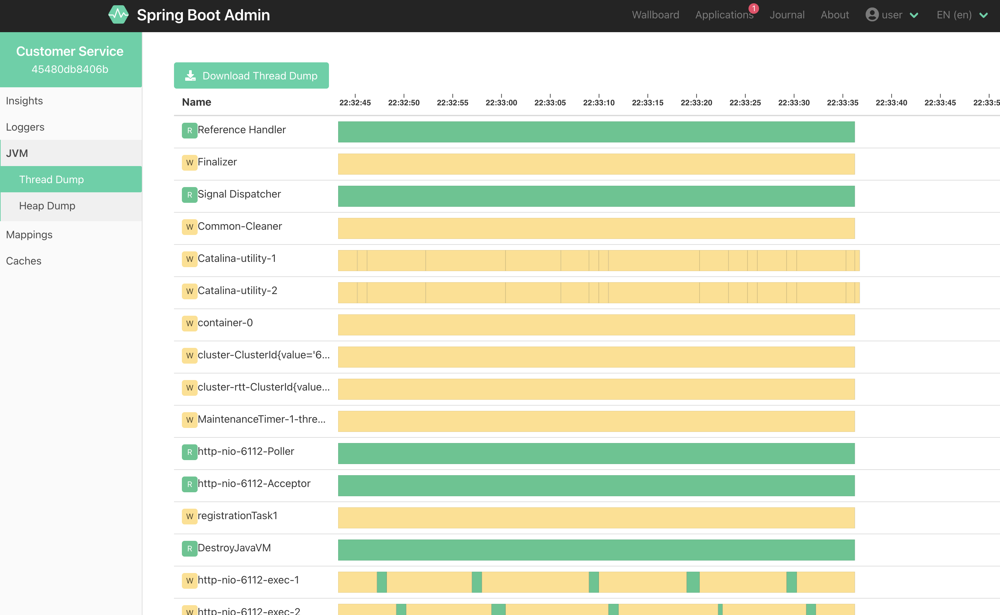

# Microservices Online Webshop

This is an example microservices application in Java that is used for demo purposes.

## Customer Service

Spring Boot Application

- Java 11

## User Service

Spring Application

- Java 8
- Spring 4.16 (XML Configuration)
- H2 Embedded Database
- Spring JDBC's `JdbcTemplate`
- Custom DAOs


## Registration Service

Spring Boot Application

- Java 11

Sends tomcat access logs as JSON to stdout. Also ships app logs to stdout as JSON.

## Spring Boot Admin

Login UI

Since it uses the spring security module the default username & password is the spring security default username & password which is:

username: user
password: <printed on console during application startup>

The username & password can be configured via the `spring.security.user.name` and the `spring.security.user.password` properties respectively.


Can inspect the details:


Looking at Threads:




## Deployment

### Helm

```bash
helm install --name microservices-online-webshop --values=./deployments/helm/dev-values.yml
```

### K8 Manifests

e.g. to deploy a single particular microservice:

```bash
kubectl apply -f ./deployments/k8-manifests/registration-service-deployment.yml
kubectl apply -f ./deployments/k8-manifests/registration-service-svc.yml
```

or to deploy all microservices:

```bash
kubectl apply -f ./deployments/k8-manifests/all.yml
```

## Author

Colin But.
